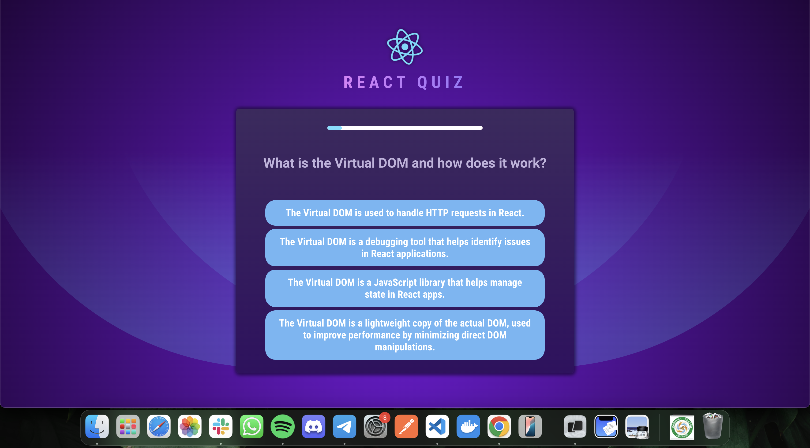
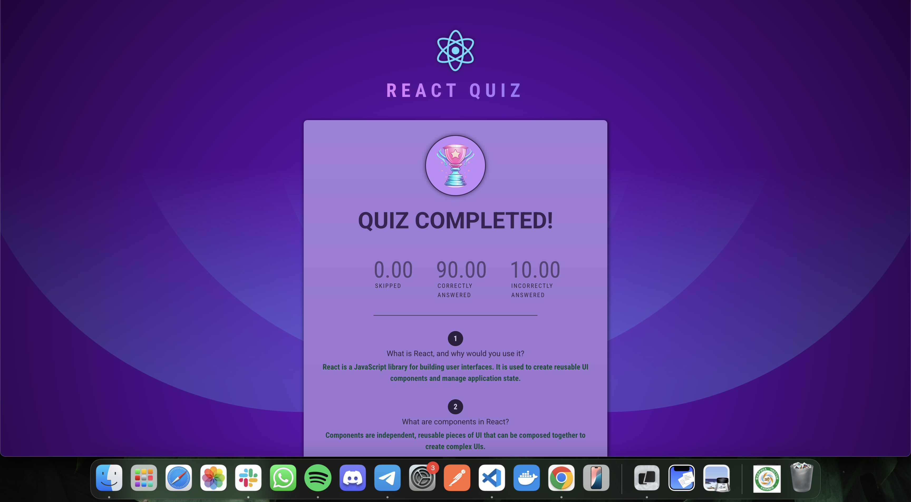

# React Quiz Application

A modern React quiz application focused on React interview questions, demonstrating **useEffect** hook, state management, and timer functionality.




## 🎯 Learning Objectives

This project was created to master:

- **useEffect** hook for side effects and timers
- **useState** hook for state management
- **useCallback** hook for performance optimization
- Timer implementation and cleanup
- Component lifecycle in functional components
- Modern React patterns and best practices

## ✨ Features

- � **Interactive Quiz**: 20 React interview questions with multiple choice answers
- ⏱️ **Timer System**: 30-second countdown for each question with auto-skip
- 🎯 **Progress Tracking**: Visual progress indicator throughout the quiz
- 📊 **Results Summary**: Detailed breakdown of correct, incorrect, and skipped answers
- 🏆 **Performance Analysis**: Percentage-based scoring system
- 🎨 **Modern UI**: Beautiful gradient design with smooth animations
- 📱 **Responsive Design**: Works seamlessly on all devices
- ⚡ **Optimized Performance**: Efficient rendering with useCallback optimization

## 🚀 Getting Started

### Prerequisites

- Node.js (v16 or higher)
- npm or yarn

### Installation

1. **Clone the repository**

   ```bash
   git clone <repository-url>
   cd practice-quiz
   ```

2. **Install dependencies**

   ```bash
   npm install
   ```

3. **Start the development server**

   ```bash
   npm run dev
   ```

4. **Open your browser**
   Navigate to `http://localhost:5173`

## 🛠️ Technologies Used

- **React 19** - Frontend framework
- **Vite** - Build tool and dev server
- **useState** - Component state management
- **useEffect** - Side effects and lifecycle
- **useCallback** - Performance optimization
- **CSS3** - Styling and animations
- **ESLint** - Code linting

## 📄 License

This project is open source and available under the [MIT License](LICENSE).
